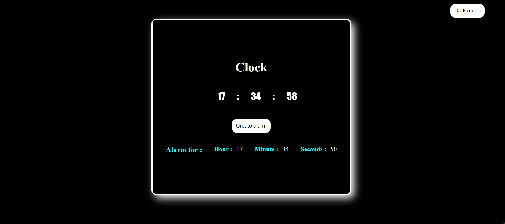
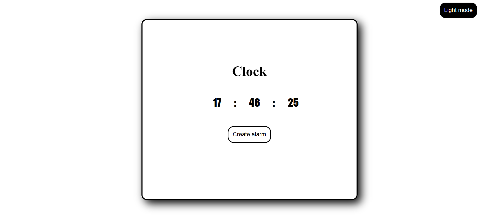

# Clock Application :alarm_clock:

This is a simple web-based clock application that provides features to view the current time, set alarms, and toggle between light and dark modes. 

## Features :gear:

- **View Current Time:** The clock displays the current time in hours, minutes, and seconds.

- **Light/Dark Mode:** You can toggle between light and dark modes for a customized appearance.

- **Set Alarms:** Set alarms for specific hours, minutes, and seconds. When an alarm matches the current time, it triggers an alert sound.

- **Interactive UI:** The user interface allows you to create and save alarms.

## Usage :computer:

1. Open the `index.html` file in your web browser.

2. Observe the current time displayed on the clock.

3. Toggle between light and dark modes by clicking the "Dark mode" button.

4. Click the "Create alarm" button to set a new alarm.

5. Enter the desired hour, minute, and second for the alarm and click the "Save" button.

6. The saved alarm details will be displayed below the clock.

7. When the alarm matches the current time, an alert sound will play.

## Screenshots :camera:

### Dark Mode

## Technical Details :wrench:

This clock application is built using HTML, CSS, and JavaScript. It leverages the browser's built-in `Date` object to track and display the current time. Alarms are set using user inputs and checked against the current time in a loop.

## Contributing :handshake:

Contributions are welcome! If you have any suggestions, improvements, or feature requests, please feel free to open an issue or submit a pull request.
